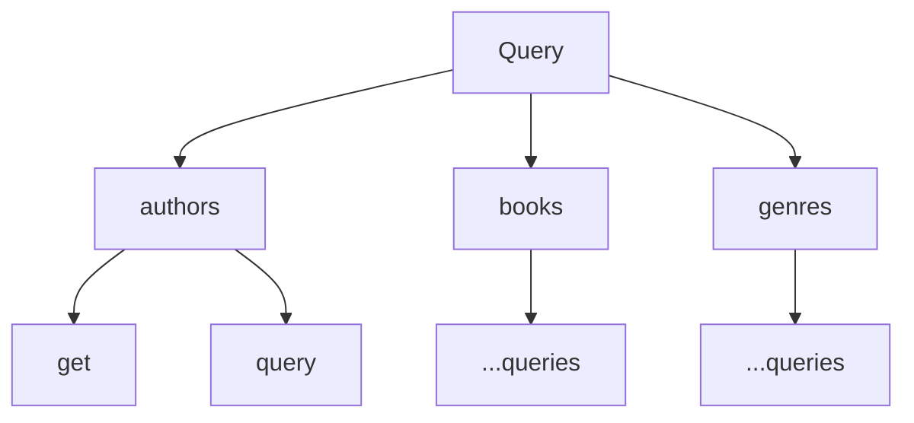
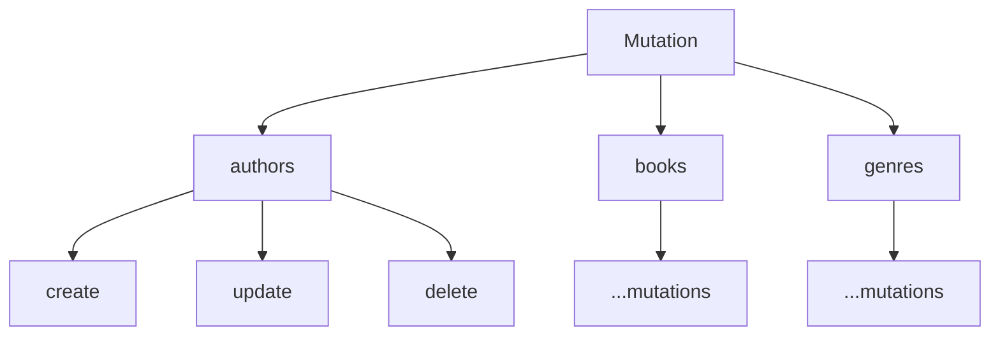

# gql-bookstore
  Small educational project with books info storage.


                           


## Starting project

```
docker-compose build
docker-compose up
```

## Db schema

TODO 

## GraphQl namespaces

Root level operation fields are organized into GraphQl namespaces. 
Each entity has the same number of queries and mutations with same naming.





## GraphQl queries and mutations

All entities have the same queries and mutations: get/query and create/update/delete.

GraphQl playground is available at localhost:8080 after starting the project. 
<details>

<summary>Books mutation example</summary>
**Creating book** 
*One genre and at least one author had been created already*

```
mutation{
  books {
    create(input: {
      title: "Воскресение"
      authors: [1]
      genre: 3
    }) {
      changed {
        id
        title
        authors {
          id
          lastname
          firstname
        }
        genre {
          id
        }
        createdAt
        updatedAt
      }
    }
  }
}
```

Result example
```
{
  "data": {
    "books": {
      "create": {
        "changed": {
          "id": 1,
          "title": "Воскресение",
          "authors": [
            {
              "id": 1,
              "lastname": "Толстой",
              "firstname": "Лев"
            }
          ],
          "genre": {
            "id": 3
          },
          "createdAt": "2024-05-07 11:09:31",
          "updatedAt": "2024-05-07 11:09:31"
        }
      }
    }
  }
}
```

**Updating book**

```
 mutation {
  books {
    update(input: {
      id: 2
      title: "Двенадцать стульев"
      authors: [4, 5]
      genre: 3
    }) {
      changed {
        id
        title
        authors {
          id
          lastname
          firstname
        }
        genre {
          id
          name
        }
      	createdAt
        updatedAt
      }
    }
  }
}
```

Result example
```
{
  "data": {
    "books": {
      "update": {
        "changed": {
          "id": 2,
          "title": "Двенадцать стульев",
          "authors": [
            {
              "id": 4,
              "lastname": "Ильф",
              "firstname": "Илья"
            },
            {
              "id": 5,
              "lastname": "Петров",
              "firstname": "Евгений"
            }
          ],
          "genre": {
            "id": 3,
            "name": ""
          },
          "createdAt": "2024-05-07 11:13:56",
          "updatedAt": "2024-05-07 11:15:06"
        }
      }
    }
  }
}
```

**Deleting book**
```
mutation {
  books {
    delete(input: {
      id: 3
    }) {
      changed {
        id
      }
    }
  }
}
```

Result example
```
{
  "data": {
    "books": {
      "delete": {
        "changed": {
          "id": 3
        }
      }
    }
  }
}
```
</details>

<details>

<summary>Books query example</summary>
**Get book by id** 

```
query {
  books {
    get(id: 1) {
      id
      title
      createdAt
      genre {
        id
      }
      authors {
        id
        lastname
        firstname
        createdAt
      }
    }
  }
}
```

Result example
```
{
  "data": {
    "books": {
      "get": {
        "id": 1,
        "title": "Воскресение",
        "createdAt": "2024-05-07 11:09:31",
        "genre": {
          "id": 3
        },
        "authors": [
          {
            "id": 1,
            "lastname": "Толстой",
            "firstname": "Лев",
            "createdAt": "2024-05-07 11:05:21",
          }
        ]
      }
    }
  }
}
```

**Query books with filter**

```
 query {
  books {
    query(filter: {
      sort:{
        field:"Title"
        order:"ASC"
      }
      pagination:{
        limit: 2
        page:2
      }
    }) {
      books {
        title
        authors {
          lastname
          firstname
        }
        createdAt
      }
      count
    }
  }
}
```
Result example
```
{
  "data": {
    "books": {
      "query": {
        "books": [
          {
            "title": "Золотой теленок",
            "authors": [
              {
                "lastname": "Ильф",
                "firstname": "Илья"
              },
              {
                "lastname": "Петров",
                "firstname": "Евгений"
              }
            ],
            "createdAt": "2024-05-07 11:21:42"
          },
          {
            "title": "Координаты чудес",
            "authors": [
              {
                "lastname": "Шекли",
                "firstname": "Роберт"
              }
            ],
            "createdAt": "2024-05-07 11:21:27"
          }
        ],
        "count": 5
      }
    }
  }
}
```
</details>